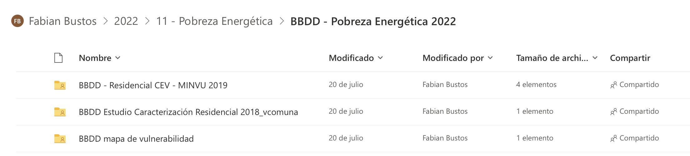

# Exploración de Datos {#data_explorer}

```{r setup, include=FALSE}
knitr::opts_chunk$set(echo = FALSE, fig.align = "center")
require(knitr)
require(kableExtra)
library(readxl)
library(sf)
library(dplyr)
library(purrr)

# visualización
library(mapview)
library(ggplot2)
library(viridis)
library(sjPlot)
library(sjmisc)
library(sjlabelled)
library(ggplot2)
library(plotly)
library(DT)

theme_set(theme_bw())

# recursos
source("R/funciones.R")


#variables globales
nhead = 5
fsize = 10
```


Las bases de datos recibidas de Probreza Energética (27-07-2022), corresponden a 3 carpetas, las cuales en el presente capítulo se procederá un análisis descriptivo general.




## BBDD Estudio Caracterización Residencial 2018_vcomuna

Corresponde un artivo excel llamado `BBDD Estudio Caracterización Residencial 2018_vcomuna.xlsx` correspondiente a la encuesta realizada a nivel nacional, que contiene dos hojas:

* **Libro de codigo**: Glosario de preguntas de la encuesta.
* **BBDD Sindicado**: Respuestas de la encuesta por comuna.


### Libro de Código

```{r}

libro_cod <- readRDS("data/rds/libro_codigo.rds") %>% 
  select(-3, -c(11:ncol(.)))

libro_cod %>% datatable( class = 'cell-border stripe', 
                         filter = 'top', 
                         options = list(pageLength = 10),
                         caption = htmltools::tags$caption(
                           style = 'caption-side: bottom; text-align: center;',
                           htmltools::em('Tabla de Libro de Códigos')) ,
                         rownames = FALSE)%>% 
  formatStyle(columns = colnames(.$x$data), `font-size` = '12px')
```

### BBDD Sindicado

Base  de resupuestas del Estudio de Caracterización Residencial comunal 2018, que contiene 3500 registros, con 552 variables, por sus grandes dimensiones no puede ser representada en su totalidad en el presente documento.


**Cantidad de Registros por Comuna**

A continuación se represetará la cantidad de registros existe por comuna

```{r}
# sindicado <- read.xlsx("data/excel/BBDD Estudio Caracterización Residencial 2018_vcomuna.xlsx", sheet = "BBDD Sindicado")
sindicado <-  readRDS("data/rds/sindicado_2018.rds")
cant_com <- sindicado %>% group_by(Comuna) %>% 
  summarise(Cantidad = n()) %>% 
  arrange(desc(Cantidad))

cant_com %>% 
  datatable( class = 'cell-border stripe', 
                         filter = 'top', 
                         options = list(pageLength = 20),
                         caption = htmltools::tags$caption(
                           style = 'caption-side: bottom; text-align: center;',
                           htmltools::em('Tabla de Libro de Códigos')) ,
                         rownames = FALSE)%>% 
  formatStyle(columns = colnames(.$x$data), `font-size` = '12px')
```

<br>

**Zona Térmica**


La tabla que cintinua representa la cantidad de registros por Zona Térmica.


```{r}

cant_zt <- sindicado %>% group_by(ZT) %>% 
  summarise(Zona_Termica = n()) %>% 
  arrange(ZT) %>% 
  mutate(ZT =as.factor(ZT))


kable_styling(
  kable(cant_zt, digits = 3, row.names = FALSE, align = "c",
        caption = NULL),
        bootstrap_options = c("striped", "hover", "condensed"),
        position = "center", full_width = TRUE,  font_size = 14) 
# cant_zt%>% 
#   datatable( class = 'cell-border stripe', 
#                          filter = 'top', 
#                          options = list(pageLength = 20),
#                          caption = htmltools::tags$caption(
#                            style = 'caption-side: bottom; text-align: center;',
#                            htmltools::em('Tabla de Libro de Códigos')) ,
#                          rownames = FALSE)%>% 
#   formatStyle(columns = colnames(.$x$data), `font-size` = '14px')

```

```{r}
fig <- plot_ly(data =cant_zt, 
  x = ~ZT, 
  y = ~Zona_Termica, 
  type = "bar",
  color =~ZT,
  colors = viridis(nrow(cant_zt)),
  text = ~Zona_Termica, textposition = 'auto'
)
fig <- fig %>% 
  layout(title = "Cantidad de Registros por Zona Térmica",
         xaxis = list(title = "Zona Térmica"),
         yaxis = list(title = "Cantidad de Registros"))
fig
```


<br>

**Zona Geográfica ("Urbano/Rural")**


```{r}

base_zona <- data.frame(Zona = c("Urbano", "Rural"),
                       Zona_Goegrafica = 1:2)


cant_zona_g <- sindicado %>%
  rename (Zona_Goegrafica ="Urbano/Rural") %>% 
  group_by(Zona_Goegrafica) %>% 
  summarise(Cantidad = n()) %>% 
  arrange(Zona_Goegrafica)  %>% 
  left_join(base_zona, by = "Zona_Goegrafica") %>% 
  select(Zona, Codigo =Zona_Goegrafica, Cantidad) %>% 
  mutate(Codigo = as.factor(Codigo))
  
kable_styling(
  kable(cant_zona_g, digits = 3, row.names = FALSE, align = "c",
        caption = NULL),
        bootstrap_options = c("striped", "hover", "condensed"),
        position = "center", full_width = TRUE,  font_size = 14) 

# cant_zona_g%>% 
#   datatable( class = 'cell-border stripe', 
#                          filter = 'top', 
#                          options = list(pageLength = 20),
#                          caption = htmltools::tags$caption(
#                            style = 'caption-side: bottom; text-align: center;',
#                            htmltools::em('Tabla de Libro de Códigos')) ,
#                          rownames = FALSE)%>% 
#   formatStyle(columns = colnames(.$x$data), `font-size` = '14px')

```

```{r}
fig <- plot_ly(data = cant_zona_g, 
  x = ~Zona, 
  y = ~Cantidad, 
  type = "bar", 
  color = ~Zona, 
  colors = viridis(nrow(cant_zona_g)),
  text = ~Cantidad, textposition = 'auto'
)
fig <- fig %>% 
  layout(title = "Cantidad de Registros por Zona Geográfica",
         xaxis = list(title = "Zoma Geográfica"),
         yaxis = list(title = "Cantidad de Registros"))
fig
```

<br>

**Nivel Socioeconómico** 


```{r}

base_nse <- data.frame(Nivel = c("C1", "C2", "C3", "D-E"),
                       NSE = 1:4)
cant_nse <- sindicado %>% group_by(NSE) %>% 
  summarise(Cantidad = n()) %>% 
  arrange(NSE) %>% 
  left_join(base_nse, by = "NSE")


kable_styling(
  kable(cant_nse, digits = 3, row.names = FALSE, align = "c",
        caption = NULL),
        bootstrap_options = c("striped", "hover", "condensed"),
        position = "center", full_width = TRUE,  font_size = 14) 


# cant_nse%>% 
#   datatable( class = 'cell-border stripe', 
#                          filter = 'top', 
#                          options = list(pageLength = 20),
#                          caption = htmltools::tags$caption(
#                            style = 'caption-side: bottom; text-align: center;',
#                            htmltools::em('Tabla de Libro de Códigos')) ,
#                          rownames = FALSE)%>% 
#   formatStyle(columns = colnames(.$x$data), `font-size` = '14px')

```

```{r}
fig <- plot_ly(data =cant_nse, 
  x = ~NSE, 
  y = ~Cantidad, 
  type = "bar", 
  color = ~Nivel, 
  colors = viridis(nrow(cant_nse)),
  text = ~Cantidad, textposition = 'auto'
)
fig <- fig %>% 
  layout(title = "Cantidad de Registros por Nivel Socioeconómico",
         xaxis = list(title = "NSE"),
         yaxis = list(title = "Cantidad de Registros"))
fig
```


## BBDD mapa vulneravilidad

### Descripción de Variables

**Nombre Archivo**: "*Detalle de campos.xlsx*"

```{r echo=FALSE}

campos <- read_excel("data/excel/Detalle de campos.xlsx")

kable_styling(
  kable(campos, digits = 3, row.names = FALSE, align = "c",
        caption = NULL),
        bootstrap_options = c("striped", "hover", "condensed"),
        position = "center", full_width = TRUE,  font_size = 11) 
```

### Analisis Bases Espaciales

```{r lectura_shp}
# lectura
names_shps <- list.files(path = "data/shapes/", pattern = ".shp$") %>% 
  gsub(".shp", "", x = .)
files_shps <-  list.files(path = "data/shapes", pattern = ".shp$",
                          full.names = T) %>% 
  map(st_read, quiet = T)

names(files_shps) <-  names_shps

```

Dentro de la carpeta llamada `BBDD mapa vulneravilidad` existen 4 archivos en formato shapefiles, con los siguientes nombres:

-   `r names_shps[1]`
-   `r names_shps[2]`
-   `r names_shps[3]`
-   `r names_shps[4]`

```{r}
region = "COQUIMBO"
var1 <- "EST_PROY_E"
var2 <- "CATEGORIA"
var3 <- "CATEGORIA"
var4 <- "CATEGORIA"
```

Para visualizar los objetos esjetos espaciales se procedió a elegir una región de `r region`, continiación se procede a hacer exploración de las tablas de contenidos y visualización espacial por cada uno de ellos:

<!-- base -->

```{r}
indice = 1
```

#### `r names(files_shps)[indice]`

**Tabla de Variables**: Región de "`r region`"

```{r}
data_reg <- files_shps[[indice]] %>% filter(NOM_REGION == region)

```

```{r}
kable_styling(
  kable(data_reg %>% st_drop_geometry() %>% head(nhead), 
        digits = 3, row.names = FALSE, align = "c",
        caption = NULL),
        bootstrap_options = c("striped", "hover", "condensed"),
        position = "center", full_width = FALSE,  font_size = fsize)%>%
  scroll_box(width = "100%")
```


```{r frec-1}

g_freq(data_sf = files_shps, indice=indice, variable = var1)
```

**Visualización Espacial**: Región de "`r region`"

```{r}

# Visualización ggplot y sf
# ggplot() +
#   geom_sf(data = data_reg, aes(color = EMPRESA_1), alpha= 0.8)+
#   scale_color_viridis_d(na.value = "gray50")+
#   ggtitle(paste0("Base: ", names(files_shps)[1], "\nRegión de: ", region)) +
#   theme_bw() +
#   theme(panel.grid.major = element_line(colour = "gray80"),
#         panel.grid.minor = element_line(colour = "gray80"))

 data_reg %>% mapview::mapview(zcol =var1, cex = 3)
```

<!-- base -->

```{r}
indice = 2

```

#### `r names(files_shps)[indice]`


**Tabla de Variables**:

```{r}
data_reg <- files_shps[[indice]] %>% filter(NOM_REGION == region)

```

```{r}
kable_styling(
  kable(data_reg %>% st_drop_geometry() %>% head(nhead), 
        digits = 3, row.names = FALSE, align = "c",
        caption =NULL),
        bootstrap_options = c("striped", "hover", "condensed"),
        position = "center", full_width = FALSE,  font_size = fsize) %>%
  scroll_box(width = "100%")
```

```{r frec-2}

g_freq(data_sf = files_shps, indice=indice, variable = var2)
```


**Visualización Espacial**: Región de "`r region`"

```{r}

# Visualización ggplot y sf
# ggplot() +
#   geom_sf(data = data_reg, aes(color = EMPRESA_1), alpha= 0.8)+
#   scale_color_viridis_d(na.value = "gray50")+
#   ggtitle(paste0("Base: ", names(files_shps)[1], "\nRegión de: ", region)) +
#   theme_bw() +
#   theme(panel.grid.major = element_line(colour = "gray80"),
#         panel.grid.minor = element_line(colour = "gray80"))

 data_reg %>% mapview::mapview(zcol =var2, cex = 3)
```

<!-- base -->

```{r}
indice = 3
```

#### `r names(files_shps)[indice]`


**Tabla de Variables**:

```{r}
data_reg <- files_shps[[indice]] %>% filter(NOM_REGION == region)

```

```{r}
kable_styling(
  kable(data_reg %>% st_drop_geometry() %>% head(nhead), 
        digits = 3, row.names = FALSE, align = "c",
        caption = NULL),
        bootstrap_options = c("striped", "hover", "condensed"),
        position = "center", full_width = TRUE,  font_size = fsize) %>%
  scroll_box(width = "100%")
```

```{r frec-3}

g_freq(data_sf = files_shps, indice=indice, variable = var3)
```


**Visualización Espacial**: Región de "`r region`"

```{r}

# Visualización ggplot y sf
# ggplot() +
#   geom_sf(data = data_reg, aes(color = EMPRESA_1), alpha= 0.8)+
#   scale_color_viridis_d(na.value = "gray50")+
#   ggtitle(paste0("Base: ", names(files_shps)[1], "\nRegión de: ", region)) +
#   theme_bw() +
#   theme(panel.grid.major = element_line(colour = "gray80"),
#         panel.grid.minor = element_line(colour = "gray80"))

 data_reg %>% mapview::mapview(zcol =var3, cex = 3)
```

<!-- base -->

```{r}
indice = 4
```

#### `r names(files_shps)[indice]`


**Tabla de Variables**:

```{r}
data_reg <- files_shps[[indice]] %>% filter(NOM_REGION == region)

```

```{r}
kable_styling(
  kable(data_reg %>% st_drop_geometry() %>% head(nhead), 
        digits = 3, row.names = FALSE, align = "c",
        caption = NULL),
        bootstrap_options = c("striped", "hover", "condensed"),
        position = "center", full_width = TRUE,  font_size = fsize) %>%
  scroll_box(width = "100%")
```
```{r frec-4}

g_freq(data_sf = files_shps, indice=indice, variable = var4)
```

**Visualización Espacial**: Región de "`r region`"

```{r}

# Visualización ggplot y sf
# ggplot() +
#   geom_sf(data = data_reg, aes(color = EMPRESA_1), alpha= 0.8)+
#   scale_color_viridis_d(na.value = "gray50")+
#   ggtitle(paste0("Base: ", names(files_shps)[1], "\nRegión de: ", region)) +
#   theme_bw() +
#   theme(panel.grid.major = element_line(colour = "gray80"),
#         panel.grid.minor = element_line(colour = "gray80"))

 data_reg %>% mapview::mapview(zcol =var4, cex = 3)
```
