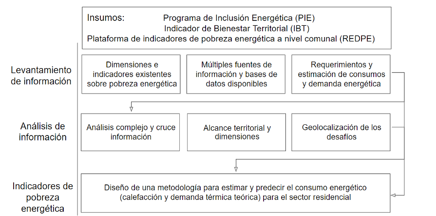
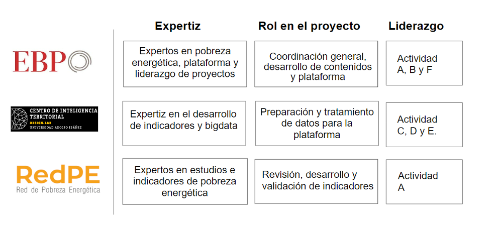
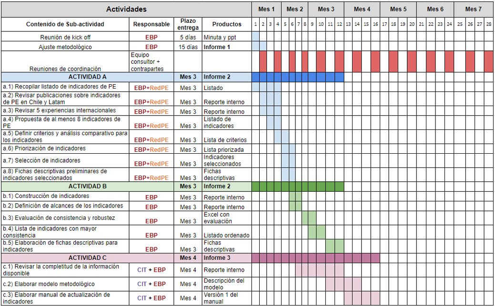
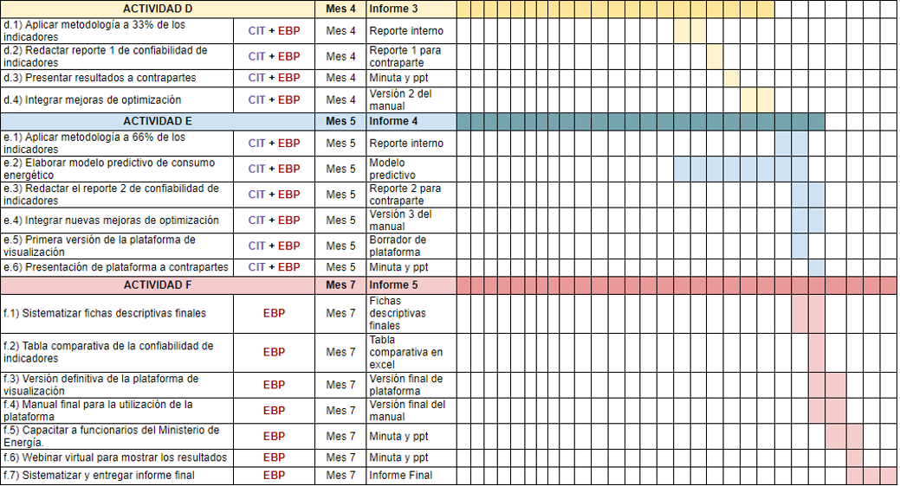

# Gestión del Proyecto {#gestion}

## Visión Global {#vision}

```{r vision, echo=FALSE, out.width="100%", fig.align='center', fig.cap="Visión Global del Proyecto"}

```

## Roles

```{r roles, echo=FALSE, out.width="100%", fig.align='center', fig.cap="Roles en el Proyecto"}

```


## Cronograma del proyecto 

```{r crono-1, echo=FALSE, out.width="120%", fig.align='center', fig.cap="Cronograma del proyecto, Actividades A,B y C"}

```
```{r crono-2, echo=FALSE, out.width="120%", fig.align='center', fig.cap="Cronograma del proyecto, Actividades D, E y F"}

```
