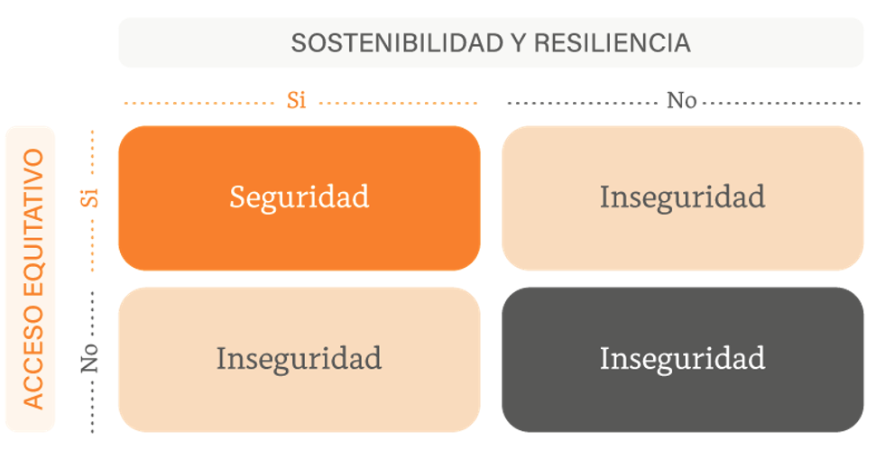
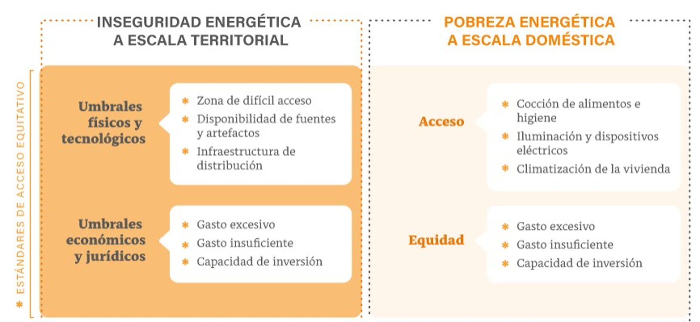
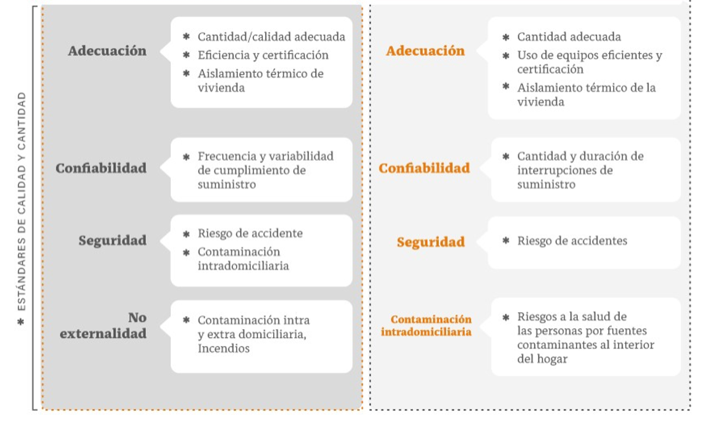
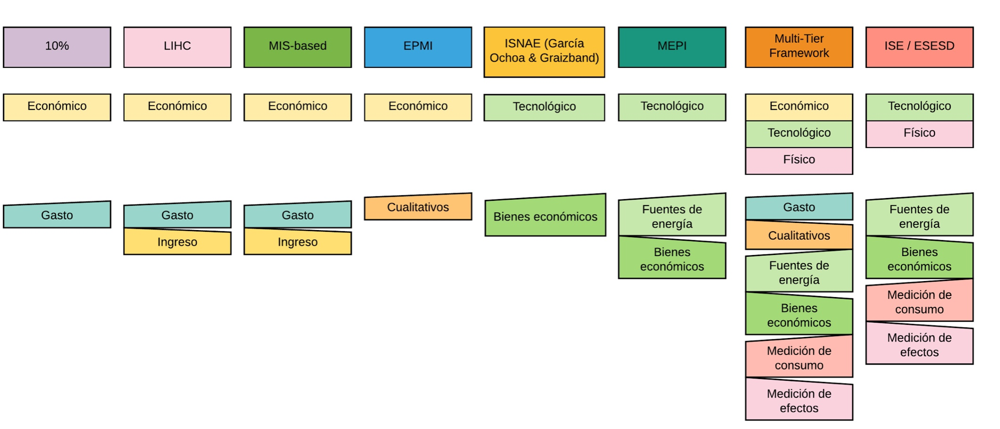
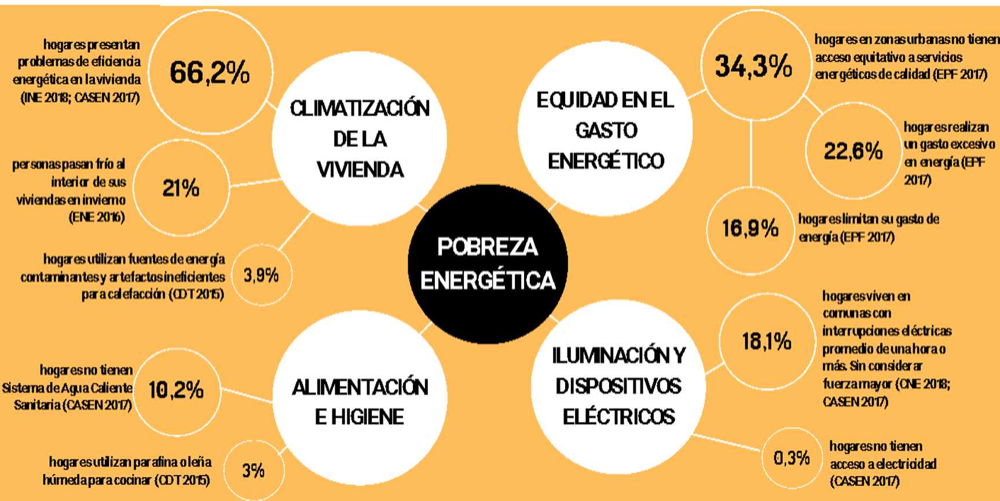
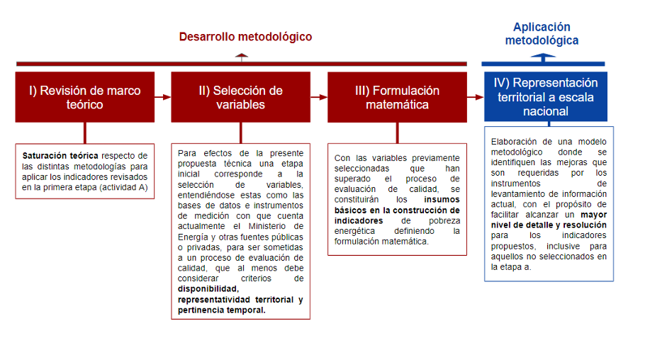
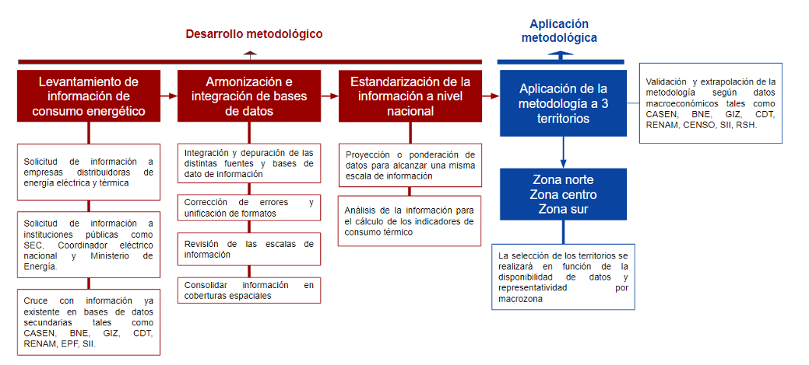
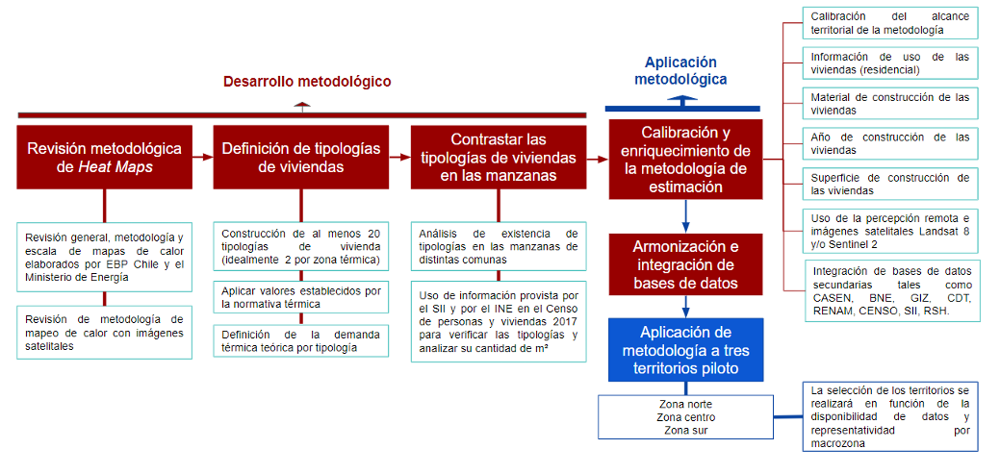

# Marco Teórico {#m-teorico}


## Definición de Conceptos

### ¿Qué es pobreza Energética? {#def-PE}

Nos referimos a Pobreza Energética cuando un hogar no tiene acceso equitativo a servicios energéticos de alta calidad (es decir, que sean adecuados, confiables, no contaminantes y seguros) para cubrir sus necesidades fundamentales y básicas que permitan sostener el desarrollo humano y económico de sus integrantes.

Un hogar se encuentra en situación de pobreza energética cuando no tiene acceso equitativo a servicios energéticos de alta calidad para cubrir sus necesidades fundamentales y básicas, que permitan sostener el desarrollo humano y económico de sus miembros. Las necesidades fundamentales son aquellas que implican impactos directos en la salud humana; mientras que las necesidades básicas corresponden a aquellos requerimientos energéticos cuya pertinencia depende de las particularidades culturales y territoriales.


```{r, echo=FALSE, out.width="100%", fig.align='center', fig.cap="Esquema conceptual Pobreza Energética"}
knitr::include_graphics("images/esquema_PE.png")

```


La pobreza energética se expresa en relación a dos grupos de necesidades: '_fundamentales_' y '_básicas_'. Las necesidades **fundamentales** son aquellas que implican impactos directos en la salud humana. Su satisfacción se considera crítica, independiente del contexto territorial. La cocción y conservación de alimentos, las temperaturas mínima y máxima saludables, el acceso al agua y la disponibilidad de suministro eléctrico continuo para personas electrodependientes en salud, se encuentran en este primer grupo. Por otra parte, las necesidades **básicas** corresponden a aquellos requerimientos cuya pertinencia depende de las características socioecológicas (biofísicas, geográficas y climáticas), sociotécnicas (tecnológicas e infraestructurales) y socioculturales (normas, mercados, costumbres y expectativas relacionadas con calidad de vida y desarrollo humano), propias de un determinado territorio. El confort térmico, el agua caliente sanitaria, la iluminación, los electrodomésticos y dispositivos tecnológicos para la educación son ejemplos de este segundo grupo.

Mientras las necesidades fundamentales se consideran de forma universal, las necesidades básicas requieren de una definición y ponderación en función de su pertinencia para una población en particular, situada en un territorio, en un contexto temporal definido y bajo condiciones socioculturales específicas.


```{r, echo=FALSE, out.width="100%", fig.align='center', fig.cap="Necesidades fundamentales y básica de energía"}
knitr::include_graphics("images/necedidades_energia.png")

```

### Seguridad Energética 

Capacidad de un territorio para garantizar acceso equitativo en cantidad y calidad a servicios energéticos resilientes y sostenibles, que permita el desarrollo económico y humano del territorio y sus habitantes. [@urquiza_water_2020]

```{r, echo=FALSE, out.width="70%", fig.align='center', fig.cap="Seguridad Energética"}


```


## Propuesta de Indicadores


### Acceso Equitativo

```{r, echo=FALSE, out.width="100%", fig.align='center', fig.cap="Estándares de acceso equitativo"}


```

### Calidad y Cantidad

```{r, echo=FALSE, out.width="100%", fig.align='center', fig.cap="Estándares Calidad y Cantidad"}


```

### Indicadores PE2050 y consultoría BID

**Indicadores Consultoría BID**

* Consumo de energía bajo condición de confort térmico vs consumo energía real (con resolución a nivel de manzana y temporalidad a ser definida)
* Gasto mensual de energía bajo condición de confort térmico vs gasto en situación real (con resolución a nivel de manzana y temporalidad a ser definida)
* Otro criterio prioritario es segmentar en base a distintas variables socio económicas (al menos nivel socio económico, pertinencia indígena y género)


**Indicadores Política Energética 2050**

* Porcentaje de hogares con acceso a electricidad de forma permanente respecto al total de hogares existentes.
* Porcentaje de hogares que acceden a calefacción, agua caliente sanitaria y cocción de alimentos a partir de fuentes de energía limpias de bajas emisiones.
* Gasto energético en el hogar (contrastado con definición establecida de gasto asequible). Se pueden considerar 3 indicadores: gasto excesivo (gasto que ubica al hogar bajo la línea de pobreza al considerar el ingreso y los otros gastos), sub-gasto (gasto menor al de hogares similares, implicando que no se alcanza el confort térmico), y porcentaje de las principales categorías de artefactos y equipos que se venden en el mercado que corresponden a equipos energéticamente eficientes.
* Porcentaje de viviendas que tienen un acondicionamiento térmico equivalente a la reglamentación térmica 2021 y 2031, del total del parque construido.


## Indicadores Internacionales {#ind_internacionales}

```{r echo=FALSE, out.width="100%", fig.align='center', fig.cap="Indicadores Internacionales"}

```

## Propuesta de Indicadores

```{r nice-fig, echo=FALSE, out.width="100%", fig.align='center', fig.cap="Esquema de propuesta de Indicadores"}

```


## Indicadores de Gasto Energético

```{r t-GE, echo = FALSE}
ind_propuestos <- read.csv("data/excel/ind_propuestos.csv", encoding="UTF-8")

# require(knitr)
# kable(ind_propuestos, digits = 3, row.names = FALSE, align = "c",
#               caption = "Indicadores de Gasto Energético. VIII - Encuesta de Presupuestos Familiares 2016-2017")

suppressPackageStartupMessages(require(knitr))
suppressPackageStartupMessages(require(kableExtra))
kable_styling(
  kable(ind_propuestos, digits = 3, row.names = FALSE, align = "c",
              caption = "Indicadores de Gasto Energético. VIII - Encuesta de Presupuestos Familiares 2016-2017", format = "html"),
        bootstrap_options = c("striped", "hover", "condensed"),
        position = "center", full_width = TRUE)
```

## Desarrollo Metodológico

Para efectos del proceso de construcción de indicadores se consideran diversas etapas que van desde I) la revisión de marco teórico, pasando por II) selección de variables, III) formulación matemática y finalizando con la IV) representación territorial. En el siguiente esquema se describen las etapas mencionadas.

```{r des-met, echo=FALSE, out.width="100%", fig.align='center', fig.cap="Esquema de Desarrollo Metodológico"}

```

### Metodología para el Consumo Energético Real


```{r met-consumo, echo=FALSE, out.width="100%", fig.align='center', fig.cap="Esquema metodológico propuesto para identificar consumo energético real"}

```


### Metodología para el Demanda Energética Real


```{r met-demanda, echo=FALSE, out.width="100%", fig.align='center', fig.cap="Esquema metodológico propuesto para estimar demanda energética teórica"}

```


## Índice Territorial de Consumo Energético (ITCE) 

Para el desarrollo del Índice Territorial de Consumo Energético, se utilizarán variables que serán la base para entrenar un modelo estimador de probabilidad, considerando su calidad, pertinencia y representatividad.  

Estas variables serán de diferentes ámbitos, fuentes, formato que nos permitirán conocer un contexto sociodemográfico, económico, espacial y cultural del territorio y la vivienda donde se determina el consumo energético en un periodo de tiempo determinado. Para lo anterior, se debe analizar y definir el o las áreas de estudio y sus zonas de contexto, que se utilizaran como piloto para el territorio nacional en las detecciones de consumo, temperatura y humedad. Variables y/o insumos que en principio se sugiere a utilizar en cada contexto son los siguientes: 

*	**Contexto sociodemográfico y económico: ** Base de datos de información predial del SII - Catastro de Campamentos Nacional (históricos y actual) – Censo de Población y Vivienda 2017 (INE) – Encuesta CASEN (MDS) – Registro Social de Hogares (MDS)– Tipos de Usos de Suelo- Encuesta Nacional de Empleo (INE) – Indicador de escolaridad de jefe de hogar por manzana (IEJ – MBHT) - Indicador de empleo por manzana (IEM – MBHT) - Indicador de participación juvenil en empleo y estudio (IPJ – MBHT) - Indicador de Resiliencia de Hogares (IRH – MBHT) - Indicador de suficiencia de viviendas (ISV – MBHT) - Indicador de calidad de la vivienda (IVI – MBHT) - Matriz de Bienestar Humano Territorial (MBHT), entre otros.  

* **Contexto territorial: ** Red Vial – Acceso a Servicios básicos (agua potable, electricidad, internet) – Indicador de seguridad ante delitos graves contra las personas (IGPE – MBHT) - Indicador de seguridad ante delitos graves contra la propiedad (IGPR – MBHT) - Indicador de seguridad ante delitos leves contra las personas (ILPE – MBHT) - Indicador de seguridad ante delitos leves contra la propiedad (ILPR – MBHT) – Zonas de riesgos Naturales – Zonas de riesgos Antrópicos – Zonas de sacrificio, entre otros. 

*	**Contexto físico y ambiental:  ** Imágenes Satelitales (Sentinel- 2, Landsat - 8) – Índice de Vegetación de diferencia Normalizada (NDVI) – Indicador de Cobertura Vegetal (ICV – MBHT) – Land Surface Temperature (LST-temperatura superficial terrestre) - Indicador de Amplitud Térmica Anual (IATA – MBHT) – Modelo de Elevación Digital (DEM) – datos de Plataforma RENAM (Temperatura, Humedad, Calidad del aire, Ruido, Demanda y Consumo eléctrico)– Identificación de sitios eriazos - VIIRS Night lights (Índice de Luces Nocturnas), entre otros.  
*	**Contexto energético: ** Consumo energético por vivienda georreferenciada (latitud y longitud o dirección), que se obtenga como variables la temporalidad (5 años), horario, materialidad de la vivienda, temperatura, humedad, entre otros.  


<!-- Referencia a tablas  \@ref(tab:t-GE) -->


<!--  \@ref(def-PE) -->
